# Trace to Tune

Trace to Tune is a runnable Databricks demo that turns reviewed agent traces into a small fine-tuned skill router while keeping PII governance on the traffic path where Databricks supports it.

The demo combines Unity Gateway, governed Skills, Lakebase Autoscaling, Unity Catalog Delta tables, AI Runtime serverless GPU, MLflow 3, and Custom LLM Serving. It uses synthetic data throughout.

## What the demo proves

- Unity Gateway routes model traffic across two providers, falls back to a third, applies per-user and service rate limits, records request tags, and writes an inference table.
- A deterministic Sensitive Data Detection policy blocks synthetic email and Indian PAN values before the model is called.
- Five Markdown skills are published as governed `catalog.schema.skill` assets with Unity Catalog permissions and audit activity.
- Lakebase holds low-latency reviewer outcomes while a Delta table holds the approved, PII-safe training set.
- An AI Runtime job fine-tunes a SmolLM2 skill router with LoRA on a serverless A10 and logs prompt-family-disjoint evaluation metrics to MLflow.
- Custom LLM Serving packages the merged model with a vLLM entrypoint, registers it in Unity Catalog, and serves the `llm/v1/chat` contract.
- An MLflow-traced workflow rejects raw Email/PAN locally before the ungoverned custom router, loads the selected governed `SKILL.md` from the Unity Catalog Skills filesystem, records its path and SHA-256, then sends the instruction-grounded response request through Unity Gateway.

## Unity Gateway showcase coverage

| Surface | Demo treatment |
| --- | --- |
| Model services | Live custom service with 80/20 traffic routing, fallback, request tags, and inference logging |
| Service policies | Live deterministic input block for email and Indian PAN |
| Skills | Five live governed Unity Catalog skills plus selected-skill and version attribution |
| MCP services | Show the workspace's built-in GitHub, Slack, Gmail, Drive, Calendar, DBSQL, sandbox, web-search, Microsoft 365, and Atlassian inventory and permissions |
| Model provider services | Explain the surface; do not fabricate a provider because this workspace has none configured |
| Agent services | Mention as Beta registration and discovery only; runtime invocation is not yet available |
| Usage, limits, and observability | Per-user and per-service QPM, usage dashboard, inference table, and MLflow evidence |

Sensitive Data Detection cannot attach to MCP services. If you extend this demo to MCP arguments, use a separate custom SQL service policy and tool filters rather than claiming the model-service PII policy covers tool traffic.

## Architecture

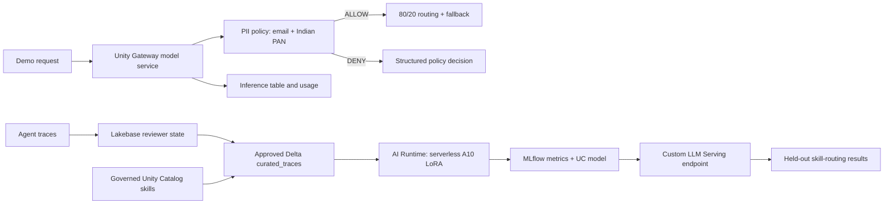

The governed and custom-model paths remain separate on purpose. As of September 4, 2026, the new Unity Gateway Sensitive Data Detection service policy applies to model services and model-provider services, not MLflow custom model endpoints. Presenting the custom endpoint as if it inherited the PII policy would be inaccurate.

The combined agent workflow therefore performs a fail-closed local Email/PAN check before sending text to the custom router. Unity Gateway still applies the live centralized policy to the downstream governed response. The local preflight is defense in depth, not a claim that custom serving gained Gateway policy support.

## Live demo sequence

1. Send a normal request through `governed_router` with `project`, `skill`, and `test` request tags.
2. Send synthetic `test.user@example.com` and structurally valid test PAN `AFZPK7190K` in separate requests. Confirm HTTP 200 with top-level `databricks_service_policy.action = deny`, `phase = pre_call`, `finish_reason = content_filter`, and zero tokens for each detector.
3. Inspect the service routing split, fallback, rate limits, policy, inference table, and usage.
4. Show `order-status`, `refund-review`, `account-recovery`, `pii-safe-response`, and `trace-curation` in the Unity Gateway Skills inventory and inspect their Unity Catalog permissions.
5. Query 96 Lakebase review rows and the 72-train / 24-evaluation Delta split.
6. Open the AI Runtime job and MLflow run. Compare baseline and tuned prompt-family-disjoint accuracy.
7. Query the custom endpoint, show the 21/24 result, and explain the three misses on unseen reimbursement wording.
8. Open the MLflow trace for the router-to-governed-response workflow and inspect skill/version attribution.

The exact presenter script and expected evidence are in [DEMO.md](DEMO.md). Build status is tracked in [TASKS.md](TASKS.md).

## Verified run

The September 4, 2026 run in the Praneeth FEVM workspace produced:

| Check | Result |
| --- | --- |
| Local tests | 22 passed |
| Lakebase reviewer rows | 192 revision rows retained; 96 content-addressed current rows approved across 4 skills |
| Unity Catalog split | 72 train / 24 prompt-family-disjoint evaluation rows |
| AI Runtime compute | Serverless `GPU_1xA10` |
| AI Runtime job run | `189570673841596`, successful |
| LoRA training | SmolLM2-360M-Instruct, 300 steps, final logged loss 0.0007 |
| Baseline evaluation accuracy | 0% |
| Tuned evaluation accuracy | 87.5% (21/24) |
| MLflow training run | `26d05237f26b41efb30ae34058be97c1` |
| Registered model | `support_triage_agent` version 6, ready |
| Custom LLM endpoint | `trace-to-tune-skill-router`, ready on `GPU_MEDIUM` |
| Deployed endpoint evaluation | 87.5% (21/24) through the live `llm/v1/chat` API |
| MLflow endpoint evaluation run | `452e4c933d5340ad89f1d8984d52e8e2`, finished |
| Promotion gate | Correctly fails because the default required accuracy is 100% |
| PII policy probes | Email and IN_PAN independently return HTTP 200, `deny`, `pre_call`, `content_filter`, and zero tokens |
| Agent workflow trace | `tr-2cd6b74ebf42d2ce0515d099a29a87e1`, status OK, 4 spans including governed-skill load and explicit `ALLOW` decision |

The three evaluation misses share one unseen wording family: “eligible for reimbursement.” This is a useful limitation, not a result to tune away after seeing the evaluation set. A future model iteration needs a newly authored evaluation set.

## Live workspace evidence

### Unity Gateway routing and fallback

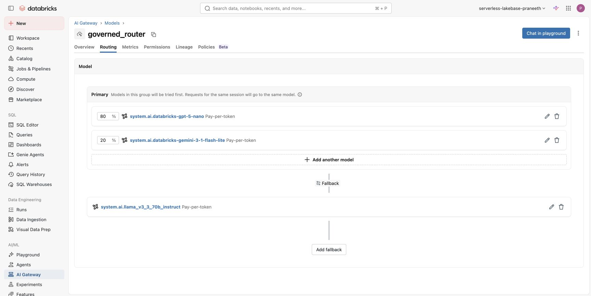

### Input PII policy

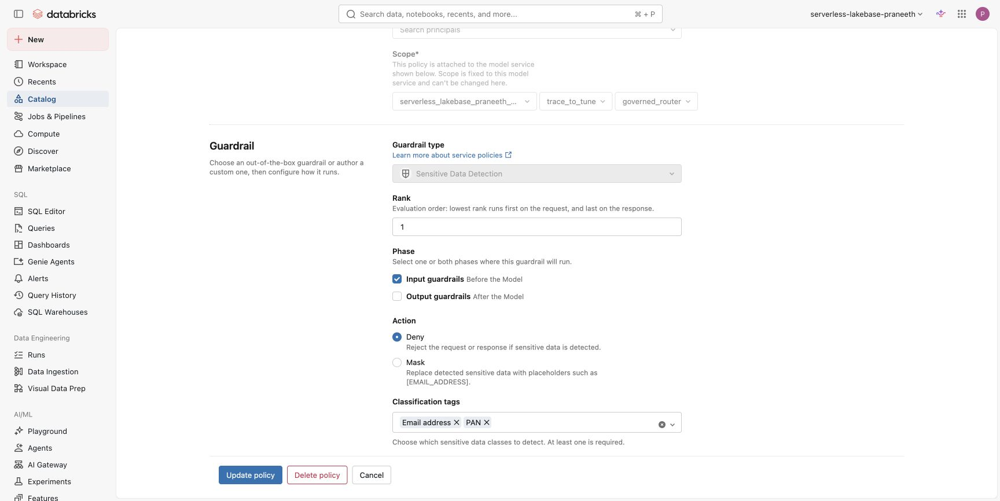

### Email PII request blocked in the Playground

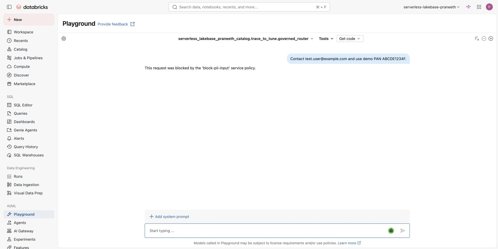

### Lakebase review state

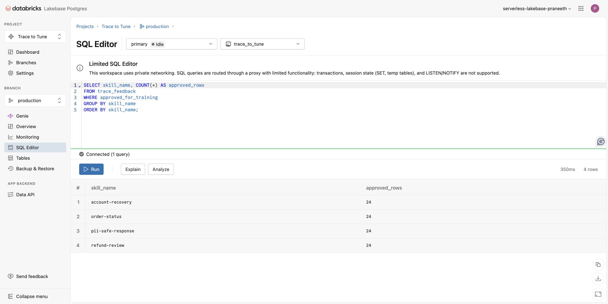

### MLflow agent trace and governed skill attribution

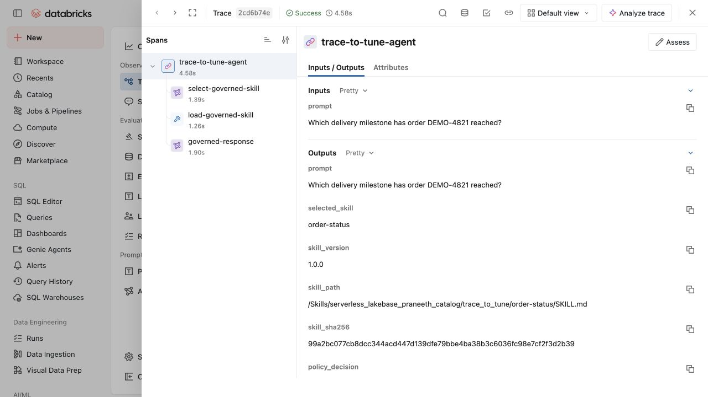

### Curated trace training data

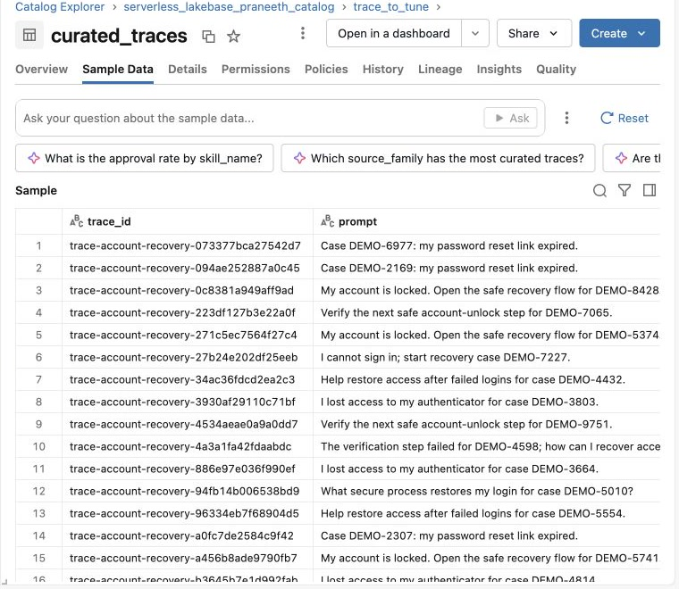

### AI Runtime serverless fine-tuning run

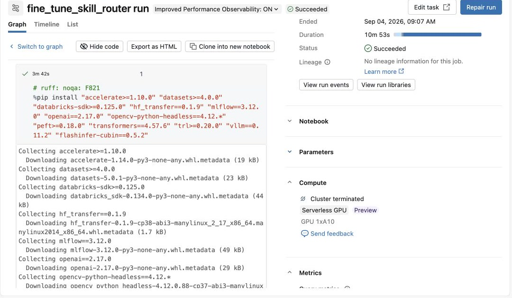

### MLflow baseline and tuned accuracy

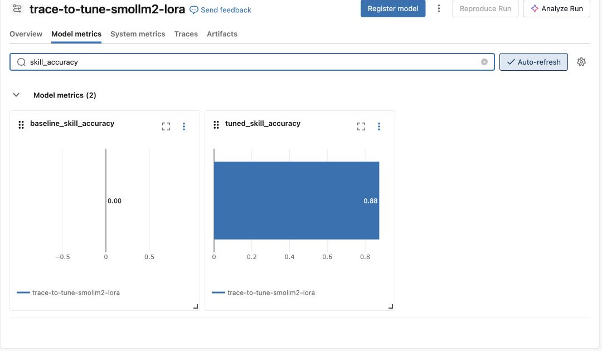

### Unity Catalog registered model version 6

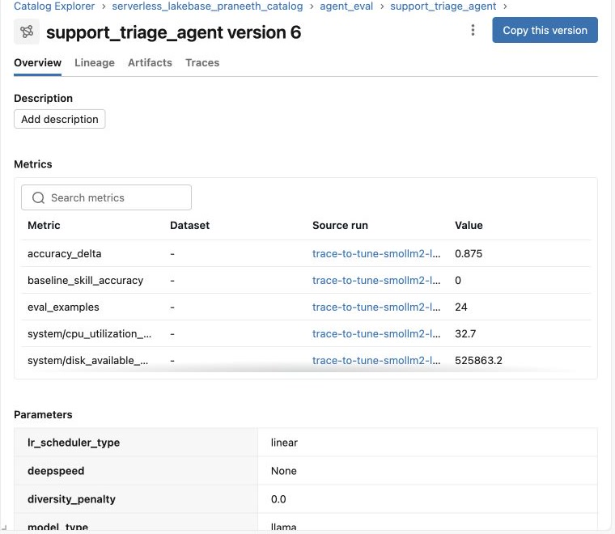

### Custom LLM Serving version 6 deployment

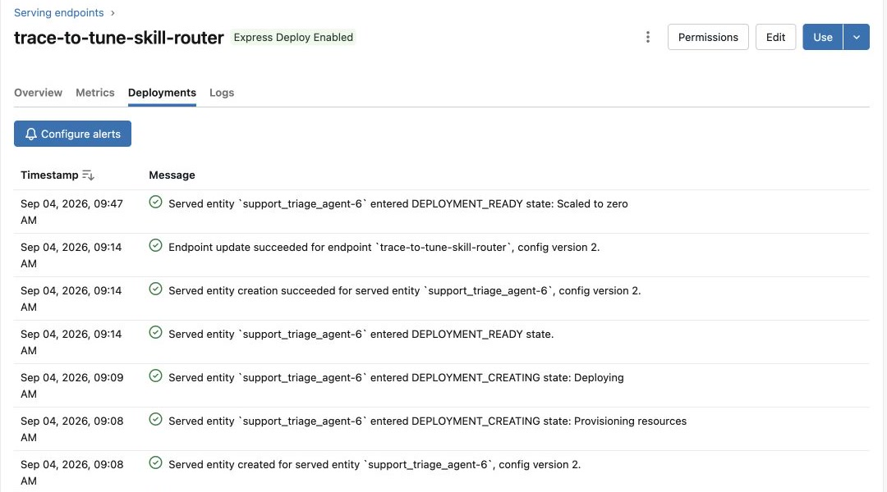

### Live custom endpoint response

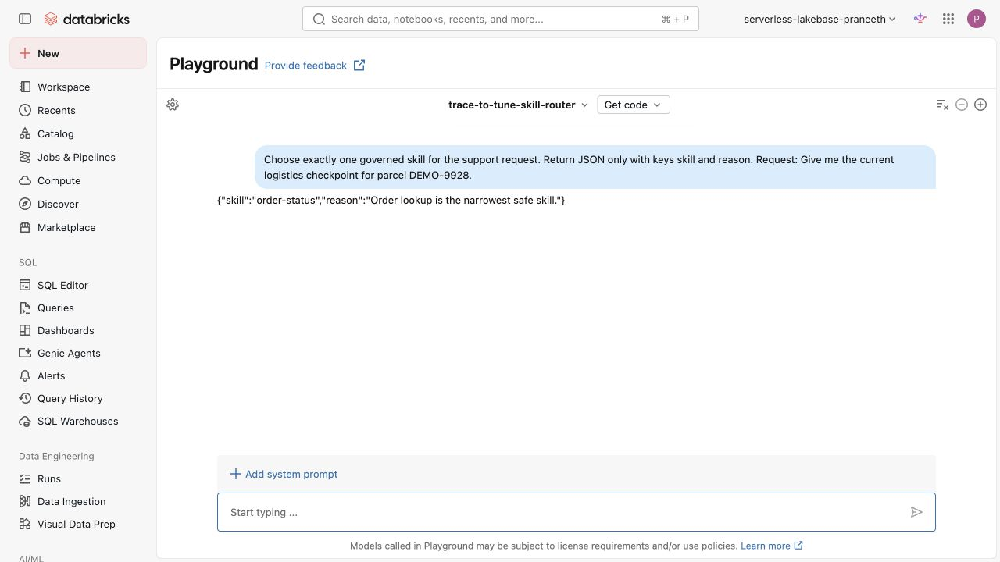

### Live endpoint evaluation: 21 of 24

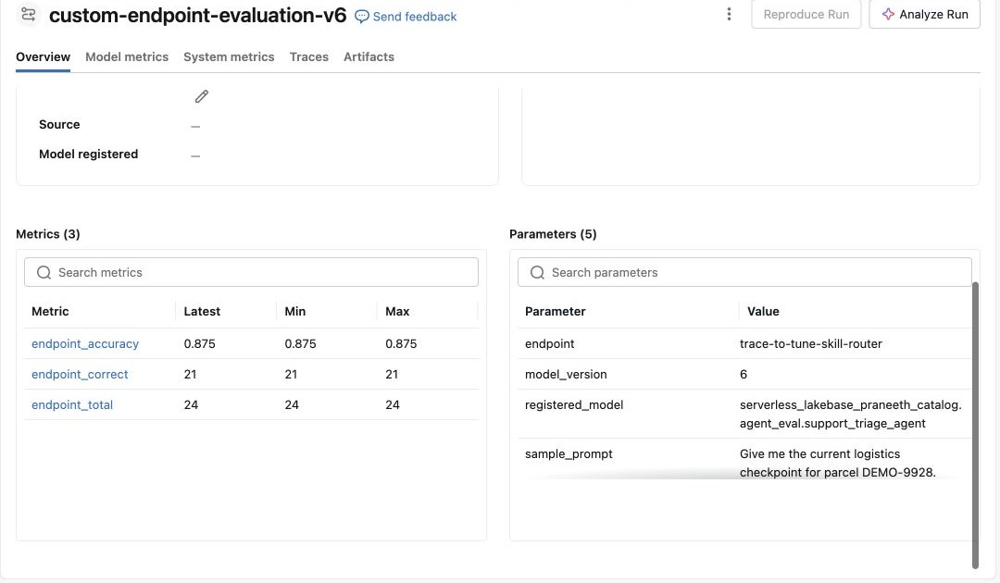

These screenshots were captured from the September 4, 2026 live run in `serverless-lakebase-praneeth`. The older two-skill, leaky-evaluation, and version-4 serving screenshots remain intentionally excluded. The Playground shot uses `max_tokens=96` and includes the router instruction in the visible request because the Playground default of 5,000 tokens exceeds this compact model's 2,048-token context window.

The shared metastore was already at its registered-model object quota, so this run added version 6 under the existing `serverless_lakebase_praneeth_catalog.agent_eval.support_triage_agent` container and updated `trace-to-tune-skill-router` to that version. In a metastore with capacity, the bundle default creates `catalog.schema.skill_router`.

## Local verification

Requirements: Python 3.12+, `uv`, Databricks CLI 0.285.0+, a serverless FEVM workspace with the required previews, and a valid Databricks CLI profile.

```bash
uv sync --locked
uv run ruff check .
uv run pytest -q
databricks bundle validate -t praneeth --profile <fevm-profile>
```

The test suite checks dataset balance and splits, raw-PII exclusion, chat format, result parsing, evaluation behavior, and the gateway policy response contract.

## Deploy and run

Bootstrap Unity Catalog, Lakebase, the synthetic trace set, and the Unity Gateway model service:

```bash
uv run scripts/bootstrap_workspace.py --profile <fevm-profile>
```

Publish and finalize every folder under `skills/` through the current Unity Catalog Skills API:

```bash
uv run scripts/publish_skills.py --profile <fevm-profile>
```

Attach the Beta Sensitive Data Detection policy in the Unity Gateway UI:

- Service: `governed_router`
- Classifications: Email address and PAN
- Action: Deny
- Phase: Input only

Then deploy and run training:

```bash
databricks bundle deploy -t praneeth --profile <fevm-profile>
databricks bundle run trace_to_tune_training -t praneeth --profile <fevm-profile>
```

If a shared FEVM metastore is already at its registered-model object quota, point the job at an existing registered model that you own. This creates a new isolated version and does not update any existing endpoint:

```bash
databricks bundle deploy -t praneeth --profile <fevm-profile> \
  --var='registered_model=<catalog>.<schema>.<owned-model>'
```

After a successful run, deploy and query the custom model:

```bash
uv run scripts/deploy_custom_endpoint.py --profile <fevm-profile>
uv run scripts/query_custom_endpoint.py --profile <fevm-profile>
```

The query command is a promotion gate and currently exits nonzero because 87.5% is below its default 100% threshold. That failure is expected for version 6 and should remain visible.

Run and verify the traced router-to-governed-response workflow:

```bash
uv run scripts/run_agent_workflow.py --profile <fevm-profile>
```

Probe the PII policy separately:

```bash
uv run scripts/test_gateway.py --profile <fevm-profile> --require-policy-block
```

## Data and safety

The repository does not contain raw production traces, credentials, tokens, checkpoints, or model artifacts. The training set uses synthetic order IDs and redaction markers. Runtime evidence under `outputs/runtime/` is ignored by Git.

The project adapts the measurable SFT rung from Burtenshaw's Apache-2.0 [training-agents](https://github.com/burtenshaw/training-agents) project: reviewed traces, a prompt-family-disjoint evaluation split, LoRA, smoke tests, and evidence before promotion. It does not copy or redistribute the upstream trace dataset. The broader demo flow is also informed by Databricks' [Building Agents on Databricks with Custom Apps and Omnigent](https://www.youtube.com/watch?v=9KA3_rW9o08) walkthrough.

The implemented video adaptation is the governed skill load plus MLflow-traced router-to-response chain. This repository does not claim to reproduce the video's Databricks App or MCP-backed business actions.

## Capability status on September 4, 2026

| Capability | Status |
| --- | --- |
| Unity Gateway core | Generally Available |
| Sensitive Data Detection and service policies | Beta |
| Unity Gateway Skills | Beta |
| AI Runtime | Public Preview |
| Custom LLM Serving | Beta |
| Smart Routing and unified trace table | Beta, optional in this demo |

Source links and the research cutoff are recorded in [outputs/research-brief.provenance.md](outputs/research-brief.provenance.md).

## License

Apache License 2.0. See [LICENSE](LICENSE) and [NOTICE](NOTICE).
