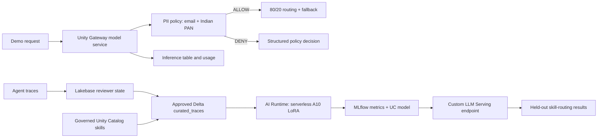
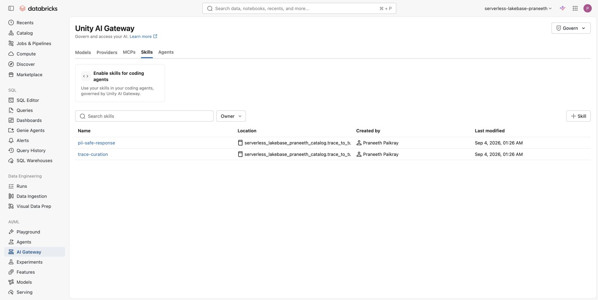
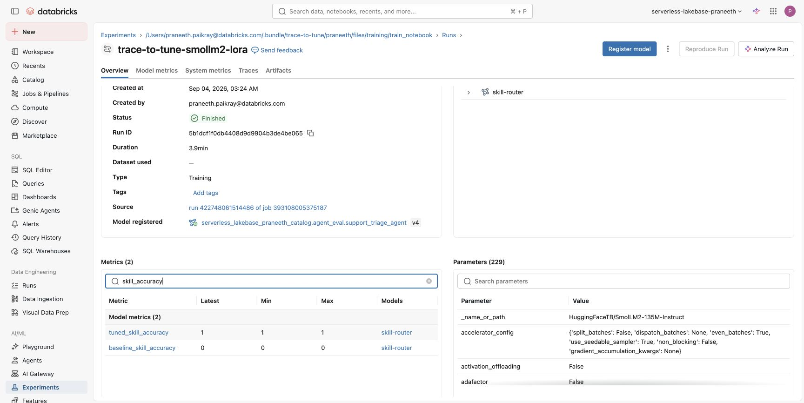
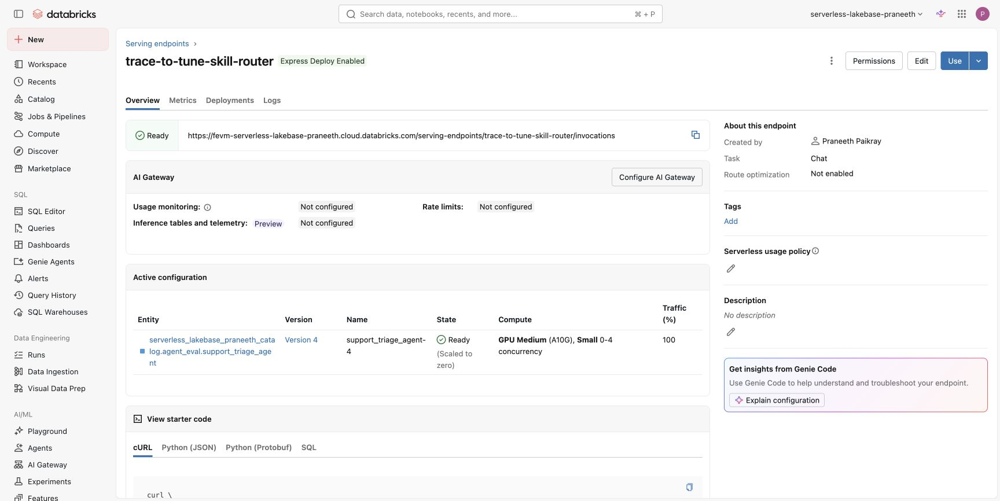

# Trace to Tune

Trace to Tune is a runnable Databricks demo that turns reviewed agent traces into a small fine-tuned skill router while keeping PII governance on the traffic path where Databricks supports it.

The demo combines Unity Gateway, governed Skills, Lakebase Autoscaling, Unity Catalog Delta tables, AI Runtime serverless GPU, MLflow 3, and Custom LLM Serving. It uses synthetic data throughout.

## What the demo proves

- Unity Gateway routes model traffic across two providers, falls back to a third, applies per-user and service rate limits, records request tags, and writes an inference table.
- A deterministic Sensitive Data Detection policy blocks synthetic email and Indian PAN values before the model is called.
- Two Markdown skills are published as governed `catalog.schema.skill` assets with Unity Catalog permissions and audit activity.
- Lakebase holds low-latency reviewer outcomes while a Delta table holds the approved, PII-safe training set.
- An AI Runtime job fine-tunes a SmolLM2 skill router with LoRA on a serverless A10 and logs frozen-split metrics to MLflow.
- Custom LLM Serving packages the merged model with a vLLM entrypoint, registers it in Unity Catalog, and serves the `llm/v1/chat` contract.

## Unity Gateway showcase coverage

| Surface | Demo treatment |
| --- | --- |
| Model services | Live custom service with 80/20 traffic routing, fallback, request tags, and inference logging |
| Service policies | Live deterministic input block for email and Indian PAN |
| Skills | Two live governed Unity Catalog skills plus request-tag attribution |
| MCP services | Show the workspace's built-in GitHub, Slack, Gmail, Drive, Calendar, DBSQL, sandbox, web-search, Microsoft 365, and Atlassian inventory and permissions |
| Model provider services | Explain the surface; do not fabricate a provider because this workspace has none configured |
| Agent services | Mention as Beta registration and discovery only; runtime invocation is not yet available |
| Usage, limits, and observability | Per-user and per-service QPM, usage dashboard, inference table, and MLflow evidence |

Sensitive Data Detection cannot attach to MCP services. If you extend this demo to MCP arguments, use a separate custom SQL service policy and tool filters rather than claiming the model-service PII policy covers tool traffic.

## Architecture



The governed and custom-model paths remain separate on purpose. As of September 4, 2026, the new Unity Gateway Sensitive Data Detection service policy applies to model services and model-provider services, not MLflow custom model endpoints. Presenting the custom endpoint as if it inherited the PII policy would be inaccurate.

## Live demo sequence

1. Send a normal request through `governed_router` with `project`, `skill`, and `test` request tags.
2. Send synthetic `test.user@example.com` and `ABCDE1234F` values. Confirm HTTP 200 with top-level `databricks_service_policy.action = deny` and `finish_reason = content_filter`.
3. Inspect the service routing split, fallback, rate limits, policy, inference table, and usage.
4. Load `pii-safe-response` and `trace-curation` from the Databricks Skills MCP server and show their Unity Catalog permissions.
5. Query 96 Lakebase review rows and the 72-train / 24-evaluation Delta split.
6. Open the AI Runtime job and MLflow run. Compare baseline and tuned frozen-split accuracy.
7. Query the custom endpoint with order-status, account-recovery, and privacy-safe prompts.

The exact presenter script and expected evidence are in [DEMO.md](DEMO.md). Build status is tracked in [TASKS.md](TASKS.md).

## Verified run

The September 4, 2026 run in the Praneeth FEVM workspace produced:

| Check | Result |
| --- | --- |
| Local tests | 9 passed |
| Lakebase reviewer rows | 96 approved rows across 4 skills |
| Unity Catalog split | 72 train / 24 held-out evaluation rows |
| AI Runtime compute | Serverless `GPU_1xA10` |
| LoRA training | 200 steps, final logged loss 0.0362 |
| Baseline held-out accuracy | 0% |
| Tuned held-out accuracy | 100% (24/24) |
| Registered model | Version 4, ready |
| Custom LLM endpoint | `trace-to-tune-skill-router`, ready on `GPU_MEDIUM` |
| Deployed endpoint evaluation | 100% (24/24) through the live `llm/v1/chat` API |
| PII policy probe | HTTP 200, `action = deny`, `phase = pre_call`, zero model tokens |

## Live workspace evidence

### Unity Gateway routing and fallback


### Input PII policy


### Governed skills



### PII request blocked in the Playground


### AI Runtime and MLflow result



### Custom LLM Serving



### Lakebase review state


The live shared metastore was already above its registered-model object quota, so the run wrote an isolated new version under an existing registered model owned by the workspace user. It did not change the existing model versions or their endpoints. In a metastore with capacity, the bundle default creates `catalog.schema.skill_router`.

## Local verification

Requirements: Python 3.12+, `uv`, Databricks CLI 0.285.0+, a serverless FEVM workspace with the required previews, and a valid Databricks CLI profile.

```bash
uv sync
uv run ruff check .
uv run pytest -q
databricks bundle validate -t praneeth --profile <fevm-profile>
```

The test suite checks dataset balance and splits, raw-PII exclusion, chat format, result parsing, evaluation behavior, and the gateway policy response contract.

## Deploy and run

Bootstrap Unity Catalog, Lakebase, the synthetic trace set, and the Unity Gateway model service:

```bash
uv run scripts/bootstrap_workspace.py --profile <fevm-profile>
```

Publish each folder under `skills/` with the `create_skill` tool from the `databricks-skill-registry` MCP server. Databricks currently exposes skill publication through `ucode` and that MCP server, not the Databricks CLI.

Attach the Beta Sensitive Data Detection policy in the Unity Gateway UI:

- Service: `governed_router`
- Classifications: `class.email_address`, `class.in_pan`
- Action: Block
- Phase: Input

Then deploy and run training:

```bash
databricks bundle deploy -t praneeth --profile <fevm-profile>
databricks bundle run trace_to_tune_training -t praneeth --profile <fevm-profile>
```

If a shared FEVM metastore is already at its registered-model object quota, point the job at an existing registered model that you own. This creates a new isolated version and does not update any existing endpoint:

```bash
databricks bundle deploy -t praneeth --profile <fevm-profile> \
  --var='registered_model=<catalog>.<schema>.<owned-model>'
```

After a successful run, deploy and query the custom model:

```bash
uv run scripts/deploy_custom_endpoint.py --profile <fevm-profile>
uv run scripts/query_custom_endpoint.py --profile <fevm-profile>
```

Probe the PII policy separately:

```bash
uv run scripts/test_gateway.py --profile <fevm-profile> --require-policy-block
```

## Data and safety

The repository does not contain raw production traces, credentials, tokens, checkpoints, or model artifacts. The training set uses synthetic order IDs and redaction markers. Runtime evidence under `outputs/runtime/` is ignored by Git.

The project adapts the measurable SFT rung from Burtenshaw's Apache-2.0 [training-agents](https://github.com/burtenshaw/training-agents) project: reviewed traces, a frozen evaluation split, LoRA, smoke tests, and evidence before promotion. It does not copy or redistribute the upstream trace dataset. The broader demo flow is also informed by Databricks' [Building Agents on Databricks with Custom Apps and Omnigent](https://www.youtube.com/watch?v=9KA3_rW9o08) walkthrough.

## Capability status on September 4, 2026

| Capability | Status |
| --- | --- |
| Unity Gateway core | Generally Available |
| Sensitive Data Detection and service policies | Beta |
| Unity Gateway Skills | Beta |
| AI Runtime | Public Preview |
| Custom LLM Serving | Beta |
| Smart Routing and unified trace table | Beta, optional in this demo |

Source links and the research cutoff are recorded in [outputs/research-brief.provenance.md](outputs/research-brief.provenance.md).

## License

Apache License 2.0. See [LICENSE](LICENSE) and [NOTICE](NOTICE).
